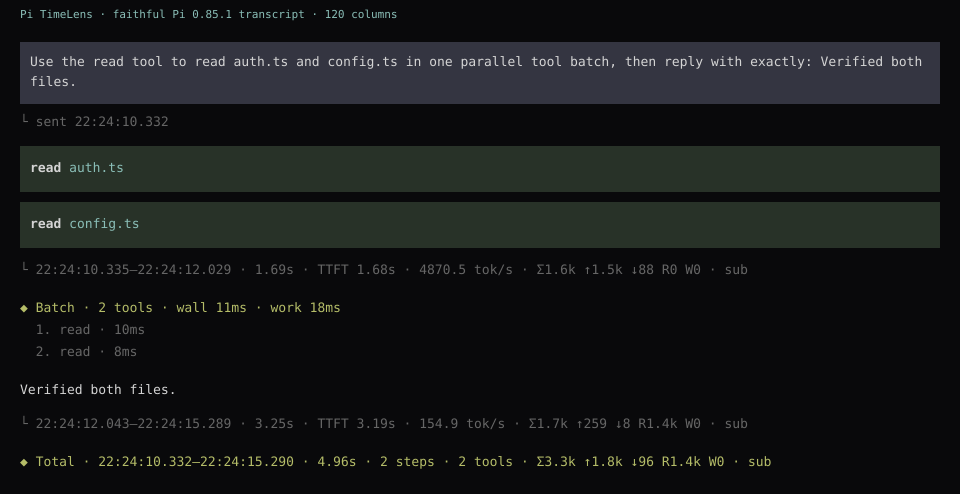
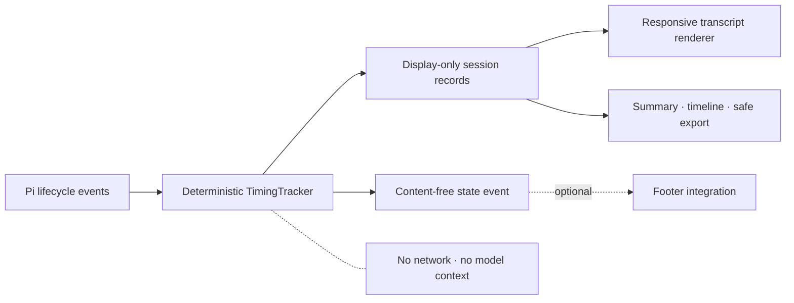

<div align="center">

# Pi TimeLens

**Know where the time and tokens went.**

Local timing and token observability for the [Pi coding agent](https://github.com/badlogic/pi-mono).

[](EVALUATION.md)
[](LICENSE)
[](https://pi.dev/packages)

</div>

Pi TimeLens makes agent latency legible without repeating Pi's transcript. Each model turn and its tools become one concise **Step** with elapsed time, response-stream latency, strict text TTFT when text exists, observed thinking time, provider-reported reasoning tokens, tool wall time, tokens, and provider-reported metered cost when relevant. Each request closes with one **Total** that answers whether time went to the model, thinking, or tools. Exact timestamps, billing scope, throughput, per-tool timing, and full token categories remain one expansion away. Everything stays local, display-only, and outside model context.

> [!IMPORTANT]
> This public repository contains the reviewed `1.0.0` release candidate. npm publication remains separately gated; the registry install command below becomes available with that release.

## Install

```bash
pi install npm:pi-timelens
```

Restart Pi, or run `/reload` in an existing session. To try it without keeping it:

```bash
pi -e npm:pi-timelens
```

**Requirements:** Pi 0.85.1 or newer and Node.js 22 or newer.

From a source checkout, use `pi install .` instead.

<picture>
  <source media="(max-width: 600px)" srcset="media/gallery-mobile.webp">
   
</picture>

_Faithful transcript redraws from real Pi 0.85.1 sessions at desktop and narrow widths. Startup, transient working/status UI, update notice, footer, and filesystem-path content are omitted; timing text, wrapping, ordering, and theme colors are preserved._

## What you get

| Lens | What it reveals |
| --- | --- |
| Live | Current phase and elapsed time while Pi is working |
| Step | One model turn plus its tools: duration, response latency, optional text TTFT, thinking, tool wall time, provider-reported tokens, and metered cost when present |
| Total | Full request duration split into model, observed thinking, and tool time, with aggregate usage and recovery status |
| Details | Exact timestamps, response and first-output diagnostics, streaming time, output speed, cumulative tool work, ordered tool timings, full token categories, model, and stop reason |
| Session | Current-branch summary, timeline, safe JSON/CSV export, and content-free footer telemetry |

```text
◆ Step · 12.1s · response 410ms · think 4.8s/1.2k tok · 7 tools 56ms
  282k tokens · 275k cached

◆ Total · 20.2s · model 19.4s · think 8.1s/2.1k tok · tools 119ms
  368k tokens · 360k cached
```

Pi's native tool cards already show which tool ran, its target, and its result. Compact TimeLens output therefore does not repeat `read`, `edit`, or every member of a parallel group. A single tool is folded into its Step just like a parallel group:

```text
◆ Step · 8.60s · response 380ms · ttft 5.21s · think 4.6s/980 tok
  tool 56ms · 86k tokens · 85k cached
```

`response` measures until Pi receives the assistant response stream. `ttft` is stricter: it appears only when a non-empty text delta exists. When Pi emits thinking events, `think` sums the observed `thinking_start` → `thinking_end` windows. If positive provider-reported reasoning tokens are the only thinking evidence, TimeLens instead uses response-stream start → first text/tool action as a provider-evidenced phase. Providers with neither signal receive no invented `think` value. Reasoning tokens are already included in provider output and total tokens, so TimeLens does not add them again.

Compact Steps and Totals omit redundant subscription labels. Subscription-backed usage still shows tokens and cache data without a fabricated price. Metered usage shows only the provider-reported cost; mixed sources show only the metered subtotal. Ordinary tools add no invented token usage; model-backed tools contribute only usage they report, exactly once, to the whole Step.

Press `Ctrl+O` to reveal billing mode, response latency, strict text TTFT, legacy first-output timing, the evidence-qualified thinking phase, the model and individual tool contributions, exact times, `wall` versus cumulative `work`, output tokens/s, and complete input/output/reasoning/cache categories. Missing provider fields stay unavailable rather than becoming fabricated zeros.

## Commands

| Command | Result |
| --- | --- |
| `/timing summary` | Aggregate the current branch |
| `/timing timeline` | Show a chronological, source-attributed timing timeline |
| `/timing legend` | Explain timing and token notation |
| `/timing settings` | Show active settings |
| `/timing settings display compact\|detailed\|off` | Change transcript density |
| `/timing settings live on\|off` | Toggle live timing status |
| `/timing settings cost on\|off` | Toggle provider-reported cost |
| `/timing settings milliseconds on\|off` | Toggle sub-second precision |
| `/timing export json\|csv` | Write a privacy-allowlisted branch export |

Press `Ctrl+O` to expand compact timing records. Settings apply immediately and persist in `~/.pi/agent/message-timing.json` (or your `PI_CODING_AGENT_DIR`).

See [Commands and settings](docs/commands.md) for examples and defaults.

## Designed for trustworthy measurements

- **Monotonic durations:** system clock adjustments cannot create negative or inflated elapsed times.
- **Provider truth only:** absent usage, reasoning-token, and cost fields remain unavailable; TimeLens does not fabricate zeros.
- **Correct concurrency:** compact Steps show elapsed tool wall time; expanded details distinguish the interval union (`wall`) from the duration sum (`work`).
- **Recoverable failures:** a later successful assistant step restores `◆ Total` while failure counts remain visible; aborts stay sticky.
- **Branch-aware reports:** summaries, timelines, and exports use only the active session branch.
- **Schema compatibility:** new Step records use V3 with additive optional response, text-TTFT, thinking, and reasoning fields; legacy V1 and V2 timing entries remain readable without rewriting sessions.
- **Responsive output:** compact rendering budgets every line for narrow terminals.

Metric definitions and edge cases are documented in [Metrics](docs/metrics.md). The reproducible microbenchmark and its limits are in [Performance](docs/performance.md).

## Private by construction

Pi TimeLens has no analytics, network client, or model call. It observes Pi lifecycle metadata and appends display-only custom entries. Those entries are rendered in the transcript but are not added to prompts sent to the model.

Exports use explicit field allowlists and exclude prompts, assistant text, tool arguments, and tool output. They are created with mode `0600` under:

```text
~/.pi/agent/state/private/message-timing-exports/
```

Like every Pi extension, installed code runs with the Pi process's local permissions. Review packages before installation. Read the complete [Privacy and security model](docs/privacy.md) and [Security policy](SECURITY.md).

## Architecture



The Pi adapter stays thin; timing, normalization, formatting, reporting, and export safety live in tested pure modules. See [Architecture](docs/architecture.md) and [Footer integrations](docs/integrations.md).

## Development

```bash
git clone https://github.com/eysenfalk/pi-timelens.git
cd pi-timelens
npm ci
npm run check
npm run smoke:packed
```

The packed-package smoke test creates a temporary offline Pi home, installs the exact npm artifact with `pi install`, verifies that `/timing` is registered, and removes the temporary files. It does not read credentials, sessions, or provider configuration. See [Development, TUI validation, and gallery workflow](docs/development-workflow.md) for the complete real-Pi and media evidence process.

Additional commands:

```bash
npm run test:coverage
npm run benchmark
npm run format
```

Read [Contributing](CONTRIBUTING.md) before opening a pull request. Releases follow [Semantic Versioning](https://semver.org/) and the process in [RELEASING.md](RELEASING.md).

## FAQ

<details>
<summary>Why is there no separate timing row for every ordinary tool?</summary>

Pi's native tool card already identifies the tool, target, and outcome. TimeLens folds its elapsed time into the surrounding Step instead of repeating that information. Expand the Step when you need the individual duration and tool-call ID.

</details>

<details>
<summary>Why can expanded tool work exceed wall time?</summary>

Parallel tools overlap. Expanded `wall` measures elapsed time across the union of their intervals; `work` adds each tool's duration. Three 1-second tools run concurrently can produce roughly 1 second wall and 3 seconds work.

</details>

<details>
<summary>What does a Step's token and price total include?</summary>

The assistant call and any model-backed tools in that turn, using only provider-reported values. Ordinary tools add time but no token usage. Mixed billing includes all reported tokens while compact output shows only the metered subtotal; expand the record or use `/timing summary` to inspect billing scope.

</details>

<details>
<summary>Why can a Step omit TTFT?</summary>

Strict TTFT requires a non-empty text delta. Tool-only turns can stream reasoning and tool calls without ever producing user-visible text, so TimeLens shows response and thinking metrics but does not mislabel another event as text TTFT.

</details>

<details>
<summary>Are reasoning tokens added to total tokens?</summary>

No. Provider-reported reasoning tokens are a subset of output and total tokens. TimeLens displays the subset for explanation but never adds it to the totals again. If the provider omits the field, TimeLens omits it too.

</details>

<details>
<summary>Does TimeLens increase prompt size?</summary>

No. Timing records are display-only custom entries and are not injected into model context.

</details>

<details>
<summary>How do I uninstall it?</summary>

```bash
pi remove npm:pi-timelens
```

Pi does not delete your settings or prior session records. Remove `message-timing.json` and private exports separately only if you no longer want them.

</details>

## License

[MIT](LICENSE) © Falk
