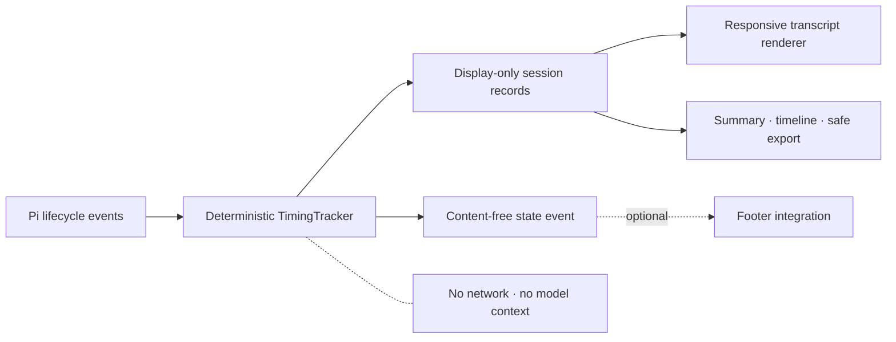

<div align="center">

# Pi TimeLens

**Every turn. Every tool. Every token.**

Local timing and token observability for the [Pi coding agent](https://github.com/badlogic/pi-mono).

[](EVALUATION.md)
[](LICENSE)
[](https://pi.dev/packages)

</div>

Pi TimeLens makes agent latency legible. It measures assistant TTFT and streaming time, shows provider-reported token categories and output speed, separates parallel tool wall time from cumulative work, and closes each request with one coherent total. Everything stays local, display-only, and outside model context.

> [!IMPORTANT]
> This public repository contains the reviewed `1.0.0` release candidate. npm publication remains separately gated; the registry install command below becomes available with that release.

## Install

```bash
pi install npm:pi-timelens
```

Restart Pi, or run `/reload` in an existing session. To try it without keeping it:

```bash
pi -e npm:pi-timelens
```

**Requirements:** Pi 0.85.1 or newer and Node.js 22 or newer.

From a source checkout, use `pi install .` instead.

<picture>
  <source media="(max-width: 600px)" srcset="media/gallery-mobile.webp">
  
</picture>

## What you get

| Lens | What it reveals |
| --- | --- |
| Assistant | Total duration, TTFT, streaming time, provider-reported output tokens/s, usage, and cost or subscription mode |
| Tools | Individual duration and reported usage for model-backed tools; ordinary tools correctly show `tok —` |
| Batches | One source-ordered record after the last tool, with elapsed `wall` time and cumulative `work` time |
| Cycle | Full request duration, model time, tool wall/work, retry wait, user wait, status, and aggregate usage |
| Session | Current-branch summary, timeline, safe JSON/CSV export, and content-free live telemetry for footer integrations |

```text
└ 12:07:13.442–12:07:16.152 · 2.71s · TTFT 820ms · 53.0 tok/s
  Σ9.9k ↑1.5k ↓284 R8.1k W0 · $0.0030

◆ Batch · 3 tools · wall 393ms · work 690ms
  1. read · 181ms · tok —
  2. bash · 393ms · tok —
  3. read · 116ms · tok —

◆ Total · 12:07:13.442–12:07:26.382 · 12.94s · 2 steps · 3 tools
  Σ22.3k ↑20.1k ↓904 R1.3k W0 · sub
```

Token symbols are optimized for narrow terminals:

- `Σ` total
- `↑` input
- `↓` output
- `R` cache read
- `W` cache write

Pi TimeLens never estimates missing provider data. A dash means unavailable, not zero.

## Commands

| Command | Result |
| --- | --- |
| `/timing summary` | Aggregate the current branch |
| `/timing timeline` | Show a chronological, source-attributed timing timeline |
| `/timing legend` | Explain timing and token notation |
| `/timing settings` | Show active settings |
| `/timing settings display compact\|detailed\|off` | Change transcript density |
| `/timing settings live on\|off` | Toggle live timing status |
| `/timing settings cost on\|off` | Toggle provider-reported cost |
| `/timing settings milliseconds on\|off` | Toggle sub-second precision |
| `/timing export json\|csv` | Write a privacy-allowlisted branch export |

Press `Ctrl+O` to expand compact timing records. Settings apply immediately and persist in `~/.pi/agent/message-timing.json` (or your `PI_CODING_AGENT_DIR`).

See [Commands and settings](docs/commands.md) for examples and defaults.

## Designed for trustworthy measurements

- **Monotonic durations:** system clock adjustments cannot create negative or inflated elapsed times.
- **Provider truth only:** absent usage and cost fields remain unavailable; TimeLens does not fabricate zeros.
- **Correct concurrency:** batch `wall` is the union of tool execution intervals; `work` is their sum.
- **Recoverable failures:** a later successful assistant step restores `◆ Total` while failure counts remain visible; aborts stay sticky.
- **Branch-aware reports:** summaries, timelines, and exports use only the active session branch.
- **Schema compatibility:** V2 records are stable and legacy V1 timing entries remain readable.
- **Responsive output:** compact rendering budgets every line for narrow terminals.

Metric definitions and edge cases are documented in [Metrics](docs/metrics.md). The reproducible microbenchmark and its limits are in [Performance](docs/performance.md).

## Private by construction

Pi TimeLens has no analytics, network client, or model call. It observes Pi lifecycle metadata and appends display-only custom entries. Those entries are rendered in the transcript but are not added to prompts sent to the model.

Exports use explicit field allowlists and exclude prompts, assistant text, tool arguments, and tool output. They are created with mode `0600` under:

```text
~/.pi/agent/state/private/message-timing-exports/
```

Like every Pi extension, installed code runs with the Pi process's local permissions. Review packages before installation. Read the complete [Privacy and security model](docs/privacy.md) and [Security policy](SECURITY.md).

## Architecture



The Pi adapter stays thin; timing, normalization, formatting, reporting, and export safety live in tested pure modules. See [Architecture](docs/architecture.md) and [Footer integrations](docs/integrations.md).

## Development

```bash
git clone https://github.com/eysenfalk/pi-timelens.git
cd pi-timelens
npm ci
npm run check
npm run smoke:packed
```

The packed-package smoke test creates a temporary offline Pi home, installs the exact npm artifact with `pi install`, verifies `/timing`, and removes the temporary files. It does not read credentials, sessions, or provider configuration.

Additional commands:

```bash
npm run test:coverage
npm run benchmark
npm run format
```

Read [Contributing](CONTRIBUTING.md) before opening a pull request. Releases follow [Semantic Versioning](https://semver.org/) and the process in [RELEASING.md](RELEASING.md).

## FAQ

<details>
<summary>Why does a tool show <code>tok —</code>?</summary>

Ordinary tools do not report model usage. TimeLens shows token data only when a provider or model-backed tool actually reports it.

</details>

<details>
<summary>Why can batch work exceed wall time?</summary>

Parallel tools overlap. `wall` measures elapsed time across the union of their intervals; `work` adds each tool's duration. Three 1-second tools run concurrently can produce roughly 1 second wall and 3 seconds work.

</details>

<details>
<summary>Does TimeLens increase prompt size?</summary>

No. Timing records are display-only custom entries and are not injected into model context.

</details>

<details>
<summary>How do I uninstall it?</summary>

```bash
pi remove npm:pi-timelens
```

Pi does not delete your settings or prior session records. Remove `message-timing.json` and private exports separately only if you no longer want them.

</details>

## License

[MIT](LICENSE) © Falk
