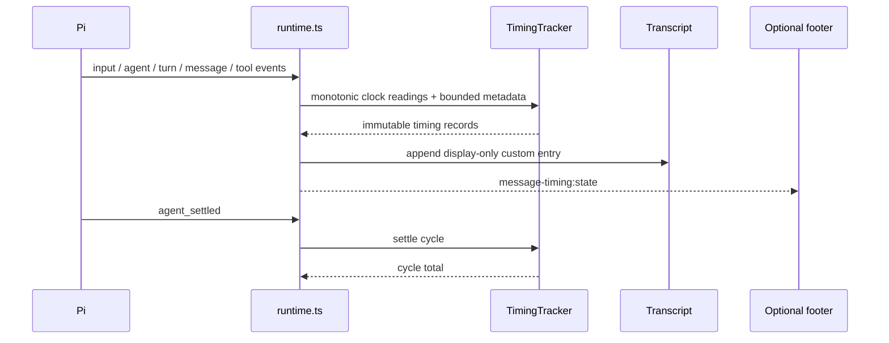

# Architecture

Pi TimeLens is deliberately small: six runtime modules, no runtime dependencies, and one thin Pi adapter.

```text
extensions/pi-timelens/
├── index.ts       # settings persistence and official Pi registration
├── runtime.ts     # Pi lifecycle and TUI adapter
├── core.ts        # clocks, tracker, records, normalization, formatting
├── reporting.ts   # branch extraction, summaries, timeline, safe export
├── commands.ts    # /timing command dispatch
└── settings.ts    # validated settings model
```

## Runtime flow



## Persistence schema

New entries use schema version 2 and stable identities for cycle, sequence, turn, batch, and tool calls. Version-1 records are coerced conservatively for replay: unavailable V2 fields remain unavailable rather than becoming fabricated zeroes.

The custom entry type remains `message-timing` for compatibility with the original extension. Brand and package names can evolve without orphaning existing Pi sessions.

## Ordering invariant

Pi creates tool UI components before results arrive, while extension custom entries are separate transcript components. Therefore:

- one tool produces one timing entry;
- multiple tools in one turn produce one consolidated batch entry after the final result;
- batch members retain source order even when completion order differs;
- cycle totals append only after settlement.

Deferred appends are cancelled on shutdown and session replacement, preventing stale records from leaking into another session.

## Test strategy

- Pure core tests cover clocks, TTFT, usage presence, concurrency math, failure recovery, aborts, formatting, and V1 compatibility.
- Runtime tests drive synthetic Pi lifecycle events, timers, session replacement, settings, and entry ordering.
- Reporting tests cover branch selection, de-duplication, hostile unknown fields, summary math, JSON, and CSV.
- Package checks inspect the npm tarball allowlist and forbid runtime install hooks.
- The packed smoke test installs the exact artifact through Pi in a temporary offline home and verifies `/timing` in fresh RPC mode.
- Release validation adds a real TUI journey and independent read-only review.
