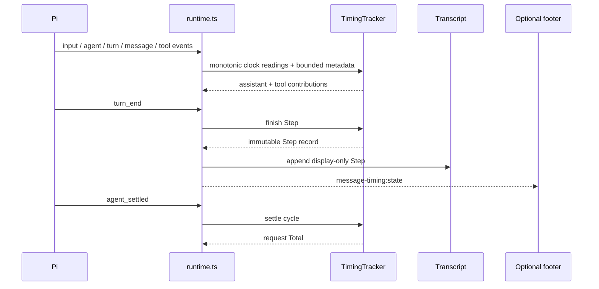

# Architecture

Pi TimeLens is deliberately small: six runtime modules, no runtime dependencies, and one thin Pi adapter.

```text
extensions/pi-timelens/
├── index.ts       # settings persistence and official Pi registration
├── runtime.ts     # Pi lifecycle and TUI adapter
├── core.ts        # clocks, tracker, records, normalization, formatting
├── reporting.ts   # branch extraction, summaries, timeline, safe export
├── commands.ts    # /timing command dispatch
└── settings.ts    # validated settings model
```

## Runtime flow



## Persistence schema

New entries use schema version 3. A Step owns one optional assistant contribution plus ordered tool contributions, aggregate usage, billing, status, elapsed duration, tool wall time, and cumulative tool work. Compact rendering intentionally omits subscription labels, while the persisted billing field remains available to expanded diagnostics, summaries, and safe exports. Stable cycle, sequence, turn, and tool-call identities remain available for reports and safe exports.

Version-1 and version-2 records are coerced conservatively for replay. Existing sessions are never rewritten, and unavailable fields remain unavailable rather than becoming fabricated zeroes.

The custom entry type remains `message-timing` for compatibility with the original extension. Brand and package names can evolve without orphaning existing Pi sessions.

## Ordering invariant

Pi creates tool UI components before results arrive, while extension custom entries are separate transcript components. Therefore:

- assistant lifecycle data is retained until its turn ends instead of creating a separate compact row;
- one or many tools join that assistant contribution in one Step after the final result;
- compact Steps do not repeat tool identities already visible in Pi's native cards;
- expanded tool members retain source order even when completion order differs;
- cycle totals append only after settlement.

Deferred appends are cancelled on shutdown and session replacement, preventing stale records from leaking into another session.

## Test strategy

- Pure core tests cover clocks, first-output latency, Step aggregation, usage presence, direct and nested model-backed tool accounting, concurrency math, failure recovery, aborts, responsive formatting, and V1/V2 compatibility.
- Runtime tests drive synthetic Pi lifecycle events, timers, session replacement, settings, and entry ordering.
- Reporting tests cover branch selection, de-duplication, hostile unknown fields, summary math, JSON, and CSV.
- Package checks inspect the npm tarball allowlist and forbid runtime install hooks.
- The packed smoke test installs the exact artifact through Pi in a temporary offline home and verifies `/timing` in fresh RPC mode.
- Release validation adds a real TUI journey and independent read-only review.
